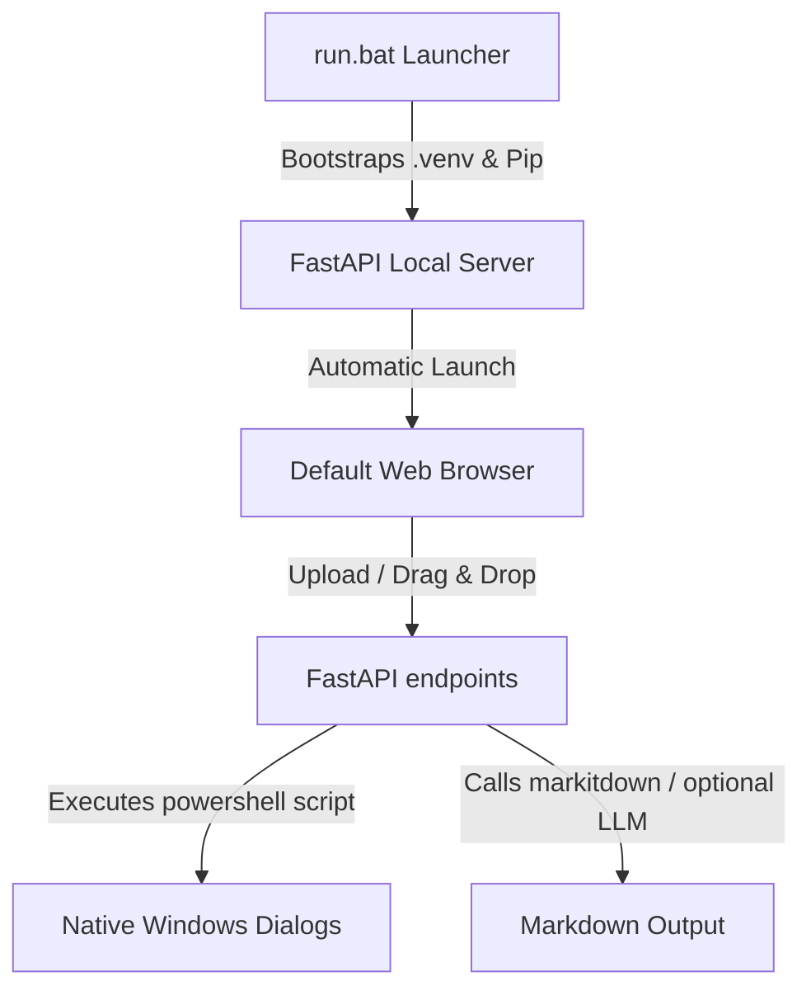

## El Reto Operativo y Contexto del Proyecto

En flujos de trabajo modernos de Inteligencia Artificial (RAG), documentación técnica y desarrollo de software, la conversión de documentos en formatos propietarios (PDF, Word, Excel, PowerPoint) a texto limpio estructurado en **Markdown (`.md`)** se ha vuelto una necesidad crítica. 

Aunque Microsoft liberó la excelente biblioteca `markitdown` basada en consola, existían importantes barreras de usabilidad para usuarios no técnicos y desarrolladores que buscan agilidad:
1. **Fricción de Consola**: Instalar Python, configurar entornos virtuales e interactuar con líneas de comandos largas y propensas a errores.
2. **Restricción de Archivos Locales**: Subir documentos a convertidores web de terceros compromete la privacidad y la confidencialidad de la información.
3. **Falta de Integración de LLMs en Interfaz**: La configuración manual de API keys y parámetros para el procesamiento de imágenes o audio requería modificar código Python de forma directa.

Para resolver este cuello de botella operativo, desarrollamos **TD-markitdown** (un producto bajo **TobonDigital.com**), una aplicación web y de escritorio premium, 100% local y con un diseño de experiencia de usuario excepcional que automatiza todo el proceso.

---

## Arquitectura del Sistema y Especificaciones

La solución se diseñó con un enfoque desacoplado, robusto y transparente, combinando un servidor local asíncrono y una interfaz web con estética visual premium.

### 1. Interfaz de Usuario Visual Premium
Diseñamos una interfaz interactiva de página única (SPA) bajo los estándares de diseño de TobonDigital:
* **Estética Glassmorphism**: Paneles semi-transparentes difuminados, sombras suaves y gradientes dinámicos de tonos violetas y cianes.
* **Experiencia de Usuario Fluida**: Animaciones de carga integradas, transiciones de desvanecimiento suaves y soporte bilingüe completo (Inglés/Español) intercambiable en tiempo real con persistencia en `localStorage`.
* **Cola de Conversión Interactiva**: Monitoreo dinámico del estado de conversión (pendiente, procesando, éxito, error), progreso porcentual global y botones contextuales para abrir el archivo convertido o revelar su ubicación en el explorador.

### 2. Puente de Diálogos Nativos mediante PowerShell
Uno de los mayores retos en aplicaciones web locales es interactuar con el sistema de archivos del usuario sin las restricciones de seguridad del navegador. 
En lugar de depender de pesados wrappers nativos o librerías gráficas bloqueantes (como Tkinter o pywebview que causaban bloqueos de hilos COM/STA en Windows), implementamos una solución ágil: **la API de backend ejecuta scripts de PowerShell en segundo plano** para invocar los diálogos nativos de Windows (`System.Windows.Forms.OpenFileDialog` y `FolderBrowserDialog`). Esto permite abrir ventanas del sistema para elegir archivos o directorios de forma segura y no bloqueante desde cualquier navegador.

### 3. Integración Inteligente de Modelos de Lenguaje (LLMs)
Configuramos un sistema modular que permite a los usuarios habilitar procesamiento avanzado con LLMs para archivos complejos (OCR en PDFs con diseño pesado, transcripción de audios `.mp3`/`.wav` o descripciones de imágenes `.png`/`.jpg` mediante modelos de visión).
* **Proveedores Soportados**: Nvidia NIM (con modelos gratuitos como `llama-3.2-11b-vision-instruct`), OpenAI (`gpt-4o`), OpenRouter (`gemini-2.5-flash`) y Endpoints Personalizados locales (como Ollama).
* **Almacenamiento Seguro**: Las API Keys y configuraciones se almacenan localmente en la máquina del usuario (`backend/config.json`) y están protegidas contra filtraciones accidentales al estar excluidas del control de versiones.

---

## Evolución Técnica y Optimización del Proceso

El desarrollo de la aplicación atravesó por un proceso de refinamiento enfocado en la estabilidad del sistema:

* **El Reto de la Compilación Silenciosa**: Inicialmente intentamos envolver el servidor en un ejecutable silencioso (`--noconsole` de PyInstaller) con interfaces incrustadas. Esto introdujo problemas severos de bloqueos en hilos del sistema operativo y comportamientos erráticos de antivirus.
* **El Reto de Uvicorn en Segundo Plano**: Al compilar en modo ventana, la ausencia de una consola (`stdout`/`stderr`) provocaba un fallo directo en la inicialización de registros de `uvicorn`.
* **Decisión de Diseño**: Revertimos a una arquitectura transparente de servidor en consola y cliente web. Crearmos un lanzador ejecutable de lotes (`run.bat`) que automatiza silenciosamente la creación del entorno virtual, actualiza las dependencias e inicia el servidor de manera visible en la consola. Esto permite a los usuarios realizar diagnósticos en tiempo real y terminar la aplicación fácilmente con `Ctrl+C`.

---

## Resultados y Conclusiones

**TD-markitdown** logró transformar un proceso puramente técnico y de línea de comandos en una herramienta de productividad corporativa de alta gama. Su arquitectura modular permite además la **actualización del núcleo** con un solo clic: la aplicación corre actualizaciones de pip en segundo plano e inyecta dinámicamente las bibliotecas del entorno virtual local (`.venv/site-packages`) en el servidor, garantizando que el usuario siempre cuente con la última versión de conversión de Microsoft sin necesidad de reinstalar el software.
